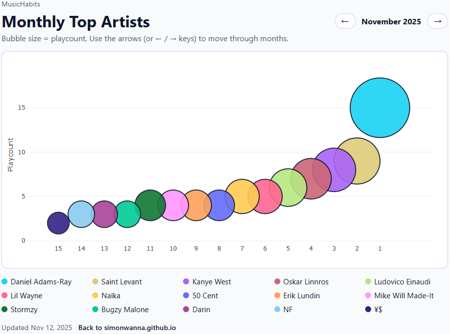

# MusicHabits :notes:
[](https://github.com/simonwanna/MusicHabits/actions/workflows/pages/pages-build-deployment)

Small project with visuals, CI/CD stuff and some vibe. Takes your Spotify stats in the end of each month --> Plotly bubbles --> GitHub Pages.
Visit [MusicHabits](https://simonwanna.github.io/MusicHabits/) to see the result.



## How it works
1. You need to have a Last.fm account and have scrobbling enabled on your Spotify app.
2. You should add GitHub secrets for your Last.fm API key and username:
```dotenv
LASTFM_API_KEY=xxx
LASTFM_USER=your_lastfm_username
```
3. GitHub actions runs a scheduled job (cron). The job fetches your top artists for the past month from Last.fm, processes the data, and updates a Plotly bubble chart UI that is deployed to GitHub Pages.

## Local development
Need secrets in a `.env` file.

Run locally:
```bash
python -m app.main          # generate site/
python -m http.server --directory site 8000  # preview
```
Pre-commit hooks (lint + tests before every commit/push):
```bash
pre-commit install --hook-type pre-commit --hook-type pre-push
```

**Note**: Manual runs on other days still target the active month, essentially refreshing the work-in-progress snapshot without duplicating history.
